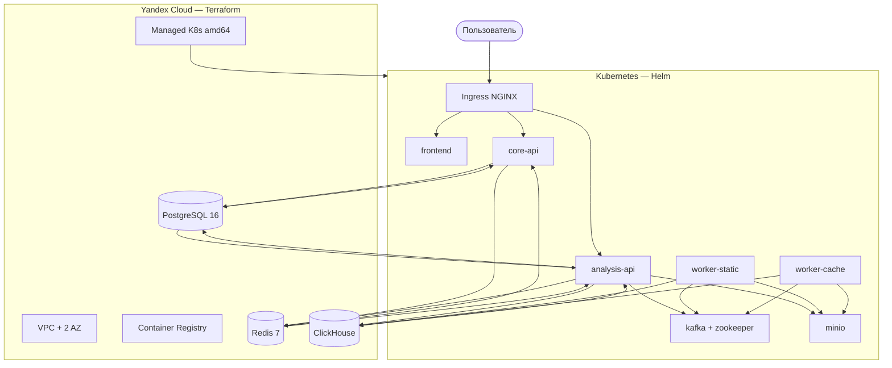

# Полный мануал инфраструктуры платформы

Документ описывает, **что сделано** в репозитории `infra`, как устроены компоненты и **какие команды запускать** для локальной разработки и production в Yandex Cloud. Значения паролей и ключей здесь **не приводятся** — они в `secrets/production.env` (не в Git) или генерируются скриптами.

---

## 1. Зачем один репозиторий `infra`

Раньше планировался отдельный `diploma-infra`; всё сведено в **существующий submodule `infra`** (`Fortech4N9/infra`):

| Режим | Инструмент | Что поднимает |
|-------|------------|---------------|
| **Dev** | Docker Compose | Postgres, Redis, MinIO, ClickHouse, Kafka, ZK, 5 сервисов, nginx |
| **Prod** | Terraform + Helm + ArgoCD | Managed K8s/DB в YC + приложение в кластере |

Один набор init-скриптов (`postgres/`, `clickhouse/`, `minio/`) используется и в compose, и в Helm hooks.

---

## 2. Карта репозитория

```
infra/
├── MANUAL.md                 ← этот документ
├── DEPLOY-K8S.md             ← краткая шпаргалка команд (production)
├── README.md                 ← краткий вход
├── docker-compose.yml        ← локальный стек
├── docker-compose.lima.yml   ← override для Lima amd64 (Wine/cache)
├── Makefile                  ← make up / lima-*
├── .env.example              ← шаблон переменных для compose
├── nginx/nginx.conf          ← маршрутизация API + frontend
│
├── postgres/                 ← схемы core_db / analysis_db
├── clickhouse/init.sql       ← таблицы analysis_metrics
├── minio/init-buckets.sh     ← source-codes, analysis-artifacts
│
├── secrets/                  ← управление секретами (см. §4)
├── scripts/
│   ├── generate-secrets.sh   ← перегенерация production.env
│   └── apply-secrets.sh      ← .env + K8s Secret
│
├── terraform/                ← Yandex Cloud (§5)
├── helm/diploma-platform/    ← Kubernetes (§6)
└── argocd/                   ← GitOps (§7)
```

Сервисы приложения (отдельные репозитории): `core-api`, `analysis-api`, `frontend`, `static-analysis-worker`, `cache-analysis-worker`. В каждом — `.github/workflows/deploy.yml` (§8).

---

## 3. Архитектура production



**Принципы:**

- **Kafka и MinIO** — только внутри K8s (Bitnami subcharts).
- **Postgres, Redis, ClickHouse** — Managed в YC (Terraform).
- **Воркеры** — образы `linux/amd64`, Wine; ноды K8s — `standard-v3` (x86), не ARM.
- **Лимиты воркеров:** `512Mi` RAM, `1` CPU — быстрый OOM-kill при тяжёлом анализе.

---

## 4. Секреты (без значений)

### 4.1 Какие ключи нужны

| Ключ | Где используется |
|------|------------------|
| `JWT_SECRET` | core-api, analysis-api |
| `POSTGRES_PASSWORD` | compose, Managed PG, K8s apps |
| `REDIS_PASSWORD` | compose, Managed Redis |
| `CLICKHOUSE_PASSWORD` | compose, Managed CH, init-job |
| `MINIO_ROOT_USER` / `MINIO_ROOT_PASSWORD` | compose, in-cluster MinIO |

Пользователь БД Postgres: **`diplom`**. Базы: **`core_db`**, **`analysis_db`**. ClickHouse DB: **`analysis_metrics`**.

### 4.2 Файлы и скрипты

```bash
cd infra

# Сгенерировать новый набор (перезапишет production.env):
./scripts/generate-secrets.sh

# Подставить в infra/.env и (если есть kubectl) в Secret diploma-platform-secrets:
./scripts/apply-secrets.sh
```

| Файл | В Git? |
|------|--------|
| `secrets/production.env` | Нет |
| `secrets/production.env.example` | Да (шаблон) |
| `secrets/external-secret.example.yaml` | Да (Lockbox / ESO) |
| `.env` | Нет |

Для Terraform те же пароли передаются как `TF_VAR_postgres_password`, `TF_VAR_redis_password`, `TF_VAR_clickhouse_password` (в `production.env` они продублированы под этими именами — подставьте из своего файла, не коммитьте).

---

## 5. Terraform (`infra/terraform/`)

### 5.1 Что создаётся

| Ресурс | Файл | Параметры по умолчанию |
|--------|------|------------------------|
| VPC + подсети | `vpc.tf` | `ru-central1-a`, `ru-central1-b` |
| Security groups | `vpc.tf` | K8s, Managed DB |
| Managed Kubernetes | `kubernetes.tf` | regional master, autoscale **2–5** нод, **standard-v3** |
| Container Registry | `container_registry.tf` | репозитории: core-api, analysis-api, frontend, worker-* |
| SA для CI push | `container_registry.tf` | ключ → output `ci_service_account_key` |
| PostgreSQL 16 | `postgresql.tf` | БД `core_db`, `analysis_db`, user `diplom` |
| Redis 7 | `redis.tf` | |
| ClickHouse | `clickhouse.tf` | БД `analysis_metrics` |

Kafka и MinIO в Terraform **не** создаются.

### 5.2 Команды

```bash
cd infra/terraform
cp terraform.tfvars.example terraform.tfvars
# Заполнить folder_id, cloud_id

# Пароли — из secrets/production.env (не печатайте в чат):
source ../secrets/production.env

terraform init
terraform plan -out=tfplan
terraform apply tfplan

terraform output -json > ../outputs.json
terraform output -raw container_registry_url
terraform output -json helm_external_endpoints
terraform output -raw ci_service_account_key > ../yc-ci-key.json
chmod 600 ../yc-ci-key.json
```

### 5.3 Полезные outputs

- `kubernetes_cluster_id` — для `yc ... get-credentials`
- `container_registry_url` — префикс образов `cr.yandex/<id>/`
- `postgres_host_fqdn`, `redis_host_fqdn`, `clickhouse_host_fqdn` — в `values.yaml` Helm
- `ci_service_account_key` — GitHub Secret `YC_SA_JSON_KEY`

---

## 6. Helm (`infra/helm/diploma-platform/`)

### 6.1 Состав чарта

**Subcharts (Chart.yaml):**

- `bitnami/kafka` — Zookeeper, `auto.create.topics.enable=true`
- `bitnami/minio` — standalone, credentials из K8s Secret

**Deployments:**

| Deployment | Порт | Образ (repository в values) |
|------------|------|-----------------------------|
| core-api | 8081 | core-api |
| analysis-api | 8082 | analysis-api |
| frontend | 80 | frontend |
| worker-static | — | worker-static |
| worker-cache | — | worker-cache |

**Helm hooks (Jobs):**

| Job | Hook | Действие |
|-----|------|----------|
| postgres-init | pre-install, pre-upgrade | `02-core-schema.sql`, `03-analysis-schema.sql` на Managed PG |
| clickhouse-init | pre-install, pre-upgrade | `files/clickhouse-init.sql` |
| minio-init | pre-install, pre-upgrade | `mc mb` → `source-codes`, `analysis-artifacts` |

**Ingress** (`templates/ingress.yaml`):

| Path | Service |
|------|---------|
| `/api/v1/auth`, `/projects`, `/admin`, `/internal` | core-api:8081 |
| `/api/v1/analysis`, `/swagger` | analysis-api:8082 |
| `/` | frontend:80 |

Аннотации: `proxy-body-size: 50m`, cert-manager issuer `letsencrypt-prod`, TLS для `code-analysis-project.ru`.

### 6.2 Настройка values.yaml

Перед установкой отредактируйте `helm/diploma-platform/values.yaml`:

```yaml
global:
  imageRegistry: cr.yandex/<REGISTRY_ID>   # terraform output
  domain: code-analysis-project.ru

external:
  postgres:
    host: <FQDN из terraform>
  redis:
    host: <FQDN>
  clickhouse:
    host: <FQDN>

secrets:
  existingSecret: diploma-platform-secrets   # создаётся apply-secrets.sh
```

```bash
cd infra/helm/diploma-platform
helm dependency update
```

### 6.3 Установка вручную (без ArgoCD)

```bash
kubectl create namespace diploma   # если ещё нет
cd infra
./scripts/apply-secrets.sh       # Secret в кластере

helm upgrade --install diploma-platform ./helm/diploma-platform \
  --namespace diploma \
  -f ./helm/diploma-platform/values.yaml \
  --wait --timeout 15m

kubectl get pods -n diploma
kubectl get jobs -n diploma
kubectl get ingress -n diploma
```

---

## 7. ArgoCD (`infra/argocd/`)

### 7.1 Структура

```
argocd/
├── apps/
│   ├── root-app.yaml          # App of Apps (platform + infrastructure)
│   ├── platform.yaml          # Helm diploma-platform → namespace diploma
│   └── infrastructure.yaml    # Ingress, cert-manager, monitoring
├── infrastructure/
│   ├── ingress-nginx.yaml
│   ├── cert-manager.yaml
│   ├── cluster-issuer.yaml      # → manifests/cluster-issuer.yaml
│   ├── kube-prometheus-stack.yaml
│   └── loki.yaml              # Loki + Promtail (логи OOM воркеров)
└── manifests/
    └── cluster-issuer.yaml      # Let's Encrypt, email admin@code-analysis-project.ru
```

В манифестах указан репозиторий: `https://github.com/Fortech4N9/infra.git` — при другом org замените.

Sync policy: `automated.prune`, `selfHeal`.

### 7.2 Установка Argo CD

```bash
kubectl create namespace argocd
kubectl apply -n argocd -f https://raw.githubusercontent.com/argoproj/argo-cd/stable/manifests/install.yaml
kubectl wait --for=condition=available deployment/argocd-server -n argocd --timeout=300s

# Пароль admin:
kubectl -n argocd get secret argocd-initial-admin-secret -o jsonpath='{.data.password}' | base64 -d && echo
```

### 7.3 Подключить приложения

```bash
cd infra
kubectl apply -f argocd/apps/infrastructure.yaml
# Дождаться Ingress Controller и cert-manager

kubectl apply -f argocd/apps/platform.yaml
# Или одним root:
kubectl apply -f argocd/apps/root-app.yaml

kubectl get applications -n argocd
```

### 7.4 DNS и HTTPS

```bash
kubectl get svc -n ingress-nginx ingress-nginx-controller \
  -o jsonpath='{.status.loadBalancer.ingress[0].ip}'
```

A-запись: `code-analysis-project.ru` → этот IP.

```bash
kubectl describe certificate -n diploma diploma-platform-tls
```

---

## 8. CI / GitOps (GitHub Actions)

В каждом репозитории сервиса: `.github/workflows/deploy.yml`.

**Триггер:** push в `main` или `workflow_dispatch`.

**Шаги:**

1. Checkout кода сервиса
2. Login в YCR (`yc-actions/yc-cr-login`, secret `YC_SA_JSON_KEY`)
3. `docker build-push` — платформа **`linux/amd64`**, тег `${{ github.sha }}`
4. Для воркеров — **registry cache** (`buildcache` tag)
5. Checkout репо `infra` (secret `INFRA_REPO`, token `PAT_TOKEN`)
6. `yq` обновляет тег в `helm/diploma-platform/values.yaml`:
   - core-api → `.coreApi.image.tag`
   - analysis-api → `.analysisApi.image.tag`
   - frontend → `.frontend.image.tag`
   - worker-static → `.workerStatic.image.tag`
   - worker-cache → `.workerCache.image.tag`
7. Commit + push в `infra` → ArgoCD подхватывает

**GitHub Secrets (в репозиториях сервисов):**

| Secret | Описание |
|--------|----------|
| `YC_SA_JSON_KEY` | JSON-ключ SA из `terraform output ci_service_account_key` |
| `YC_REGISTRY_ID` | ID реестра из `terraform output container_registry_id` |
| `PAT_TOKEN` | GitHub PAT с правом push в `infra` |
| `INFRA_REPO` | Например `Fortech4N9/infra` |

---

## 9. Локальная разработка (Docker Compose)

Не требует Yandex Cloud.

```bash
cd infra
cp .env.example .env
./scripts/apply-secrets.sh    # или вручную скопировать из production.env в .env

make up
make status                 # curl health
make logs
make down
```

| URL (по умолчанию) | Сервис |
|--------------------|--------|
| http://localhost:8080 | nginx → frontend + API |
| :15432 | Postgres |
| :16379 | Redis |
| :19000 / :19001 | MinIO / console |
| :18123 | ClickHouse HTTP |
| :19092 | Kafka |

**Apple Silicon + cache-worker (Wine):** см. `Makefile` → `make lima-up`, `lima-stack` и `docker-compose.lima.yml`.

---

## 10. Полный порядок production «с нуля»

```text
1. yc init
2. ./scripts/generate-secrets.sh && ./scripts/apply-secrets.sh   # локально; TF_VAR из production.env
3. cd terraform && terraform apply
4. yc managed-kubernetes cluster get-credentials ...
5. ./scripts/apply-secrets.sh   # K8s Secret в namespace diploma
6. Правка helm/diploma-platform/values.yaml (registry, FQDN БД)
7. kubectl apply -f argocd/...  OR  helm upgrade --install
8. DNS → IP Ingress
9. docker build/push образов  OR  push в main → GitHub Actions
10. Проверка https://code-analysis-project.ru
```

Дублирование команд без пояснений: **[DEPLOY-K8S.md](./DEPLOY-K8S.md)**.

---

## 11. Сборка образов вручную

```bash
yc container registry configure-docker
export REGISTRY_ID=$(cd infra/terraform && terraform output -raw container_registry_id)
export TAG=$(git rev-parse --short HEAD)

docker build --platform linux/amd64 -t cr.yandex/${REGISTRY_ID}/core-api:${TAG} ./core-api
docker push cr.yandex/${REGISTRY_ID}/core-api:${TAG}
# ... analysis-api, frontend, worker-static, worker-cache
```

`worker-static` зависит от базового образа `keplar01/static-analyzer:latest`.  
`worker-cache` — долгая сборка (Ubuntu + `cats`).

---

## 12. Проверка и отладка

```bash
kubectl get pods -n diploma
kubectl logs -n diploma deploy/worker-cache --tail=200
kubectl logs -n diploma deploy/worker-static --tail=200
kubectl get ingress -n diploma
curl -k https://code-analysis-project.ru/health
```

| Проблема | Что проверить |
|----------|----------------|
| ImagePullBackOff | `ycr-pull-secret`, тег в values, login в YCR |
| 413 на upload | Ingress `proxy-body-size: 50m` |
| Воркер OOMKilled | ожидаемо на плохом C; логи в Loki (namespace monitoring) |
| Wine / cache fail | нода **amd64**, не ARM |
| ClickHouse init fail | FQDN, SG, пароль в Secret |
| Argo OutOfSync | `kubectl get applications -n argocd` |

---

## 13. Kafka-топики (справка)

Создаются автоматически (`auto.create.topics.enable`):

- `events.analysis.start_static`
- `events.analysis.static_completed`
- `events.analysis.start_cache`
- `events.analysis.cache_completed`

Подробнее: `kafka-contracts.md`.

---

## 14. Что не входит в `infra`

| Компонент | Где |
|-----------|-----|
| VS Code extension | `vs-code/` |
| Документация VitePress | `docs/` |
| Исходники API/воркеров | отдельные submodule-репозитории |

---

## 15. Чеклист перед защитой / демо

- [ ] `terraform apply` успешен, outputs сохранены
- [ ] Ноды K8s Ready, архитектура amd64
- [ ] Secret `diploma-platform-secrets` в namespace `diploma`
- [ ] Init-jobs Completed (postgres, clickhouse, minio)
- [ ] Все 5 deployment Running
- [ ] HTTPS на домене, загрузка `.c` работает
- [ ] CI secrets настроены в GitHub, push обновляет values.yaml

---

*Версия мануала соответствует структуре репозитория `infra` в монорепо `gybryd-analytic`.*
